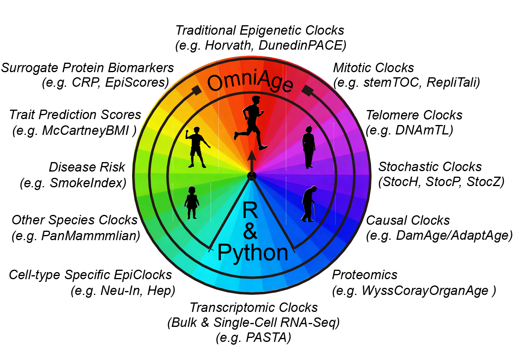

<p align="center">
  
</p>

<h1 align="center">OmniAge 🧬</h1>

<p align="center">
    <strong>A cross-platform computational suite for biological aging biomarkers.</strong>
</p>

<p align="center">
  <a href="https://github.com/Duzhaozhen/OmniAge/stargazers"></a>
  <a href="https://github.com/Duzhaozhen/OmniAge/issues"></a>
  <a href="LICENSE"></a>
</p>

---

**OmniAge** is a cross-platform computational suite designed for the robust estimation and analysis of biological aging biomarkers. It provides a unified framework supporting both **R** and **Python**, integrating a vast suite of aging clocks and biomarkers (including Epigenetic, Transcriptomic, Mitotic, and more).


## 📂 Repository Structure (Monorepo)

This repository is organized as a monorepo to ensure version consistency across platforms:

* **`OmniAgeR/`**: An R package providing the core implementation of aging clocks and biomarkers.
* **`OmniAgePy/`**: A Python package (`omniage`) optimized for high-throughput aging omic biomarker prediction.
---

## 🚀 Installation

### 1. R Version
Install the development version directly from GitHub using `devtools`:

```r
# install.packages("devtools")
devtools::install_github("Duzhaozhen/OmniAge", subdir = "OmniAgeR")
```

### 2. Python Version
Install via pip with the subdirectory flag:

```r
git clone https://github.com/Duzhaozhen/OmniAge.git
cd OmniAge/OmniAgePy
pip install .
```
> [!TIP]
> If you encounter errors building **pyarrow** or **h5py** (common on Linux servers), we recommend pre-installing these dependencies via Conda:
> 
> ```bash
> conda install -c conda-forge pyarrow h5py
> ```
---

## 📖 Quick Start
### Python API
```r
import omniage
import pandas as pd
import numpy as np

# Initialize the clock (automatically handles model decompression)
clock = DNAmCTFClock()

print("1. Loading Lung Pre-cancerous Lesions Dataset...")
beta_df = pd.read_csv("../example/data/LungInv_beta.csv", index_col=0)
meta_df = pd.read_csv("../example/data/LungInv_pheno.csv", index_col=0)
print(meta_df['Group'].value_counts())

print("2. Calculating Mitotic Ages...")
# Batch calculate all mitotic clocks using the "mitotic" group alias.
mitotic_ages = omniage.cal_epimarker(beta_df, clocks="Mitotic",ages=meta_df['Age'],return_dict=False)
```

### R API
```r
library(OmniAgeR)

download_OmniAgeR_example("LungInv")
load_OmniAgeR_example("LungInv")
EpiAge.o<-EpiAge(data.m = bmiq.m,clock_names = "mitotic",ages.v = df$Age)
```

---

## 📖 Tutorials & Documentation

We provide step-by-step guides to help you get started with OmniAge:

### Python (omniage)
* [Python Package Tutorial](tutorial/OmniAgePy_tutorial.html) - Comprehensive guide for the Python-based workflow

### R (OmniAgeR)
* [R Package Tutorial](tutorial/OmniAgeR_tutorial.html) - Comprehensive guide for the R-based workflow.

---


