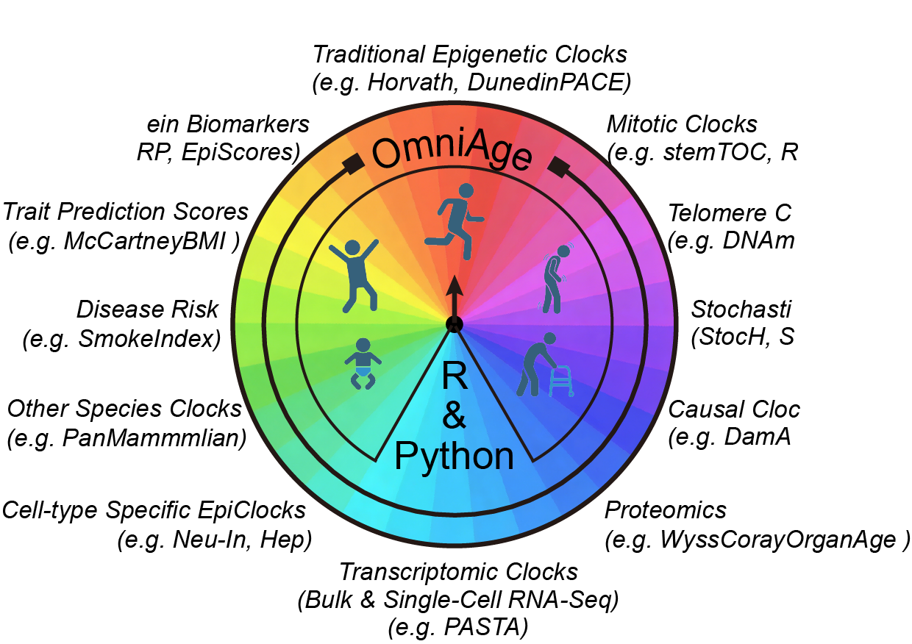

<p align="center">



</p>

<h1 align="center">

OmniAge 🧬

</h1>

<p align="center">

<strong>A cross-platform computational suite for biological aging biomarkers.</strong>

</p>

<p align="center">

<a href="https://github.com/Duzhaozhen/OmniAge/stargazers"></a> <a href="https://github.com/Duzhaozhen/OmniAge/issues"></a> <a href="LICENSE"></a>

</p>

------------------------------------------------------------------------

**OmniAge** is a cross-platform computational suite designed for the robust estimation and analysis of biological aging biomarkers. It provides a unified framework supporting both **R** and **Python**, integrating a vast suite of aging clocks and biomarkers (including Epigenetic, Transcriptomic, Mitotic, and more).

## 📂 Repository Structure (Monorepo)

This repository is organized as a monorepo to ensure version consistency across platforms:

- **`OmniAgeR/`**: An R package providing the core implementation of aging clocks and biomarkers.

- **`OmniAgePy/`**: A Python package (`omniage`) optimized for high-throughput aging omic biomarker prediction.
---

## 🚀 Installation

### R Version

Install the development version directly from GitHub:

```r
install.packages("remotes")

remotes::install_github(
    "Duzhaozhen/OmniAge",
    subdir = "OmniAgeR",
    upgrade = "never"
)
```

#### Alternative installation from a downloaded ZIP file

If direct installation from GitHub fails because of network restrictions or
an unstable connection:

1. Select **Code → Download ZIP** on this GitHub page.
2. Save the downloaded archive, for example as `OmniAge-main.zip`.
3. Install it locally:

```r
install.packages("remotes")

remotes::install_local(
    path = "~/Downloads/OmniAge-main.zip",
    subdir = "OmniAgeR",
    upgrade = "never"
)
```

Alternatively, extract the ZIP archive and install from the package directory:

```r
remotes::install_local(
    path = "~/Downloads/OmniAge-main/OmniAgeR",
    upgrade = "never"
)
```

> Downloading the repository ZIP avoids problems when accessing GitHub during
> package installation. An internet connection may still be required to install
> missing dependencies and download large optional model-data files.

### Python Version

Clone the repository and install the Python package:

```bash
git clone https://github.com/Duzhaozhen/OmniAge.git
cd OmniAge/OmniAgePy
pip install .
```

Alternatively, download and extract the repository ZIP file, open a terminal
inside `OmniAge-main/OmniAgePy`, and run:

```bash
pip install .
```

> [!TIP] If you encounter errors building **pyarrow** or **h5py** (common on Linux servers), we recommend pre-installing these dependencies via Conda:
>
> ``` bash
> conda install -c conda-forge pyarrow h5py
> ```
>
> ------------------------------------------------------------------------

## 📖 Quick Start

### Python API

``` r
import omniage
import pandas as pd
import numpy as np

# Initialize the clock (automatically handles model decompression)
clock = DNAmCTFClock()

print("1. Loading Lung Pre-cancerous Lesions Dataset...")
beta_df = pd.read_csv("../example/data/LungInv_beta.csv", index_col=0)
meta_df = pd.read_csv("../example/data/LungInv_pheno.csv", index_col=0)
print(meta_df['Group'].value_counts())

print("2. Calculating Mitotic Ages...")
# Batch calculate all mitotic clocks using the "mitotic" group alias.
mitotic_ages = omniage.cal_epimarker(beta_df, clocks="Mitotic",ages=meta_df['Age'],return_dict=False)
```

### R API

``` r
library(OmniAgeR)

# Load the lung methylation dataset
lungInv <- loadOmniAgeRdata(
    "omniager_lung_inv",
    verbose = FALSE
)

#Extract methylation matrix and phenotype data
lungInvM <- lungInv$bmiq_m
phenoDf <- lungInv$PhenoTypes

#Calculate the epigenetic clock
epiMarkerRes <- epiMarker(
    betaM = lungInvM,
    clockNames = "mitotic",
    chronAge = phenoDf$Age,
)
```

------------------------------------------------------------------------

## 📖 Tutorials & Documentation

We provide step-by-step guides to help you get started with OmniAge:

### Python (omniage)

- [Python Package Tutorial](tutorial/OmniAgePy_tutorial.html) - Comprehensive guide for the Python-based workflow

### R (OmniAgeR)

- [R Package Tutorial](tutorial/OmniAgeR_tutorial.html) - Comprehensive guide for the R-based workflow.

------------------------------------------------------------------------

## Citation

If you use the OmniAge tool in your research, please cite my paper:

> **Du, Z.**, Ling, Y., Tong, H., Guo, X., & Teschendorff, A. E. (2026). The OmniAge compendium of aging omic biomarkers links mitotic clocks to clonal hematopoiesis and causality. *Nature Communications*. https://doi.org/10.1038/s41467-026-76038-w
